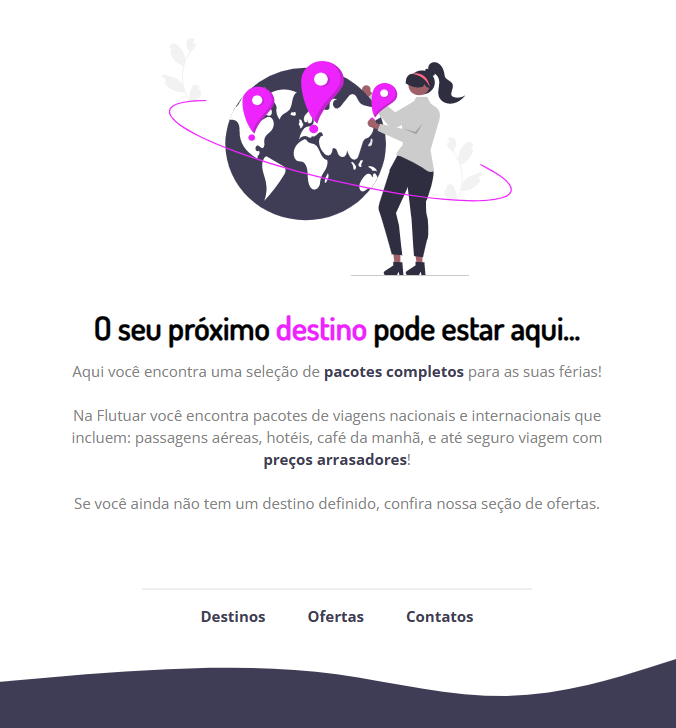

<h1 align="center">FLUTUAR.COM </h1>

 
 

  

 
    <a href="https://fernandoaugustodev.github.io/Flutuar.com/" target="_blank" ><button style = "font-size:20px; border-radius:6px; padding: 10px; background: #02799D; color: #fff" >VEJA O PROJETO</button></a>

## 💻 Sobre o Projeto
 

  Recriando o layout do desafio explorer Rocketseat - Flutuar.com

 

## 🛠 Techs

Tecnologias usadas neste projeto

✅ HTML  
✅ CSS  
---

## 👨🏼‍💻 Autor

Fernando Augusto 

 
  
 
© 2023 GitHub, Inc.
Terms Privacy Security Status Docs
